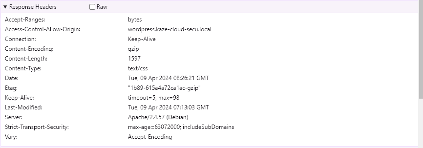
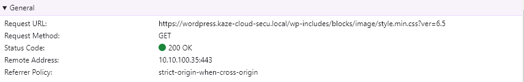
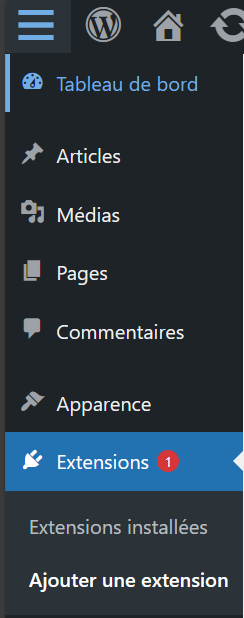
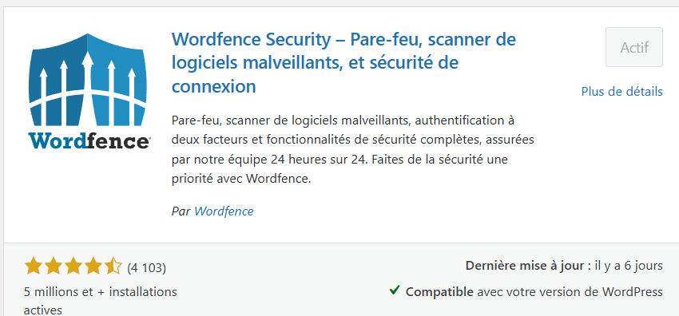
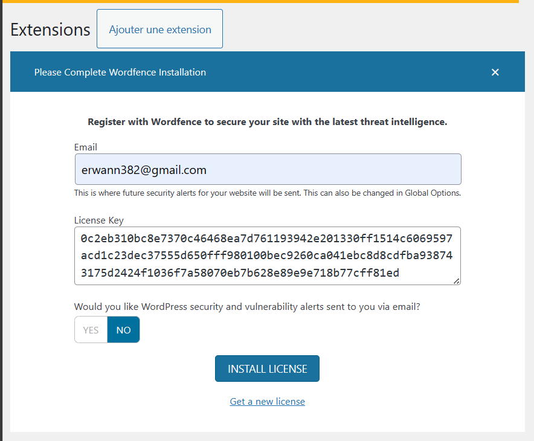
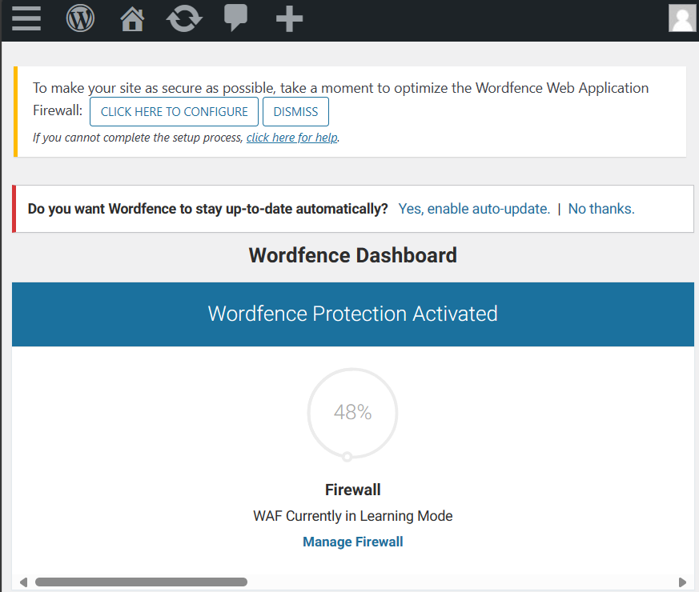

# Procédure installation & sécurisation site Wordpress [POC]

Cette documentation traite de l'installation d'un site Wordpress de façon sécurisée pour un contexte de production.

## Réseaux
### Topologie


Les entreprises disposant d’un site Web public utilisé par leurs clients doivent rendre leur serveur Web accessible à Internet. Pour protéger le réseau local de l’entreprise, le serveur Web est installé sur un serveur distinct des ressources internes. La DMZ permet la communication entre les ressources commerciales protégées, telles que les bases de données internes, et le trafic qualifié d’Internet.

Un réseau DMZ sert de tampon entre Internet et le réseau privé d’une entreprise. La DMZ est isolée par une passerelle de sécurité, telle qu’un pare-feu, qui filtre le trafic entre la DMZ et un réseau LAN. Le serveur de la DMZ est protégé par une autre passerelle de sécurité qui filtre le trafic provenant de réseaux externes.

Nous utiliserons une machine virtuelle qui fonctionnera sous [opnsense](https://opnsense.org/) comme système d'exploitation. Elle fera office de routeur firewall. Le compartiment des différents réseaux se fera à l'aide des switchs virtuels. 

### Matrice de flux et ACL

| Source/Destination | Serveur Web       | Serveur de BDD   | WAN          |
|--------------------|-------------------|-------------------|--------------|
| Serveur Web        | -                 | - permit          | - permit     |
| Serveur de BDD     | - deny            | -                 | - deny       |
| WAN                | - permit          | - deny            | -            |

Dans cette matrice :

- La connexion entre le serveur web et le serveur de base de données est autorisée.
- Le WAN peut accéder au serveur web, mais l'accès au serveur de base de données est refusé.
- Les tirets (-) indiquent les cases où aucun flux n'est autorisé ou refusé. Cela peut être interprété comme "aucune règle spécifique définie".
- Les données peuvent circuler de manière bidirectionnelle entre les sources et les destinations
- La règle par défaut est  `deny deny`

> Nous détaillerons pas la configuration d'ACL sur l'opnsense.

### NAT

Sur l'interface WAN il faudra créer la règle NAT de port forwarding suivante: 

| DESTINATION IP | FROM IP        | PORT | FORWARD IP  | FORWARD PORT | PROTOCOL |
|----------------|----------------|------|-------------|--------------|----------|
| @WAN_IP   | ANY                 | 80   | @LAN_IP_WEB | 80           | TCP      |
| @WAN_IP   | ANY                 | 443  | @LAN_IP_WEB | 443          | TCP      |

- **@WAN_IP** : Correspond à l'IP WAN de l'interface du routeur firewall
- **@LAN_IP_WEB** : Correspond à l'IP lan du serveur WEB. 

> Nous détaillerons pas la configuration de règles NAT de port forwarding sur l'opnsense.

## Back end

### Update

```bash
sudo apt update
```

```bash
sudo apt full-upgrade -y
```

```bash
reboot
```

### Installation base de données

Vous pouvez installer MariaDB à l'aide de la commande suivante :
```bash
apt install mariadb-server mariadb-client
```

Démarrez le démon du serveur de base de données et activez-le pour qu'il démarre automatiquement au prochain démarrage à l'aide des commandes suivantes :
```bash
systemctl start mariadb
systemctl enable mariadb
```

### Post installation

Une fois le serveur de base de données installé, exécutez la commande suivante pour sécuriser votre serveur MariaDB:
```bash
mysql_secure_installation
```

Plusieurs questions de configuration vous seront alors posées, auxquelles vous devrez répondre Y à chacune d'entre elles.
```bash
Remove anonymous users? [Y/n]: Y
Disallow root login remotely? [Y/n]: Y
Remove test database and access to it? [Y/n]:  Y
Reload privilege tables now? [Y/n]:  Y
```

Relancer le service mariadb:
```bash
systemctl restart mariadb
```

### Création un utilisateur base de données limiter

```bash
CREATE USER 'wordpress'@'192.168.0.1' IDENTIFIED BY 'CHANGEME';
CREATE DATABASE wordpress;
GRANT ALL PRIVILEGES ON wordpress.* TO 'wordpress'@'192.168.0.1';
FLUSH PRIVILEGES;
EXIT;
```

## Fron end

### Update

```bash
sudo apt update
```

```bash
sudo apt full-upgrade -y
```

```bash
reboot
```

### Installation basique de Wordpress

#### Installation Apache

Nous commencerons par l'installation du serveur web Apache.

Pour installer le serveur web Apache, exécutez la commande suivante :

```bash
sudo apt install apache2 -y
```

Puis on active le service:
```bash
sudo systemctl enable apache2 && sudo systemctl start apache2
```

Vérifions que le sevice fonctionne:
```bash
sudo systemctl status apache2
```


La sortie de commande ressemble à cela:
```bash
root@host:~# sudo systemctl status apache2
● apache2.service - The Apache HTTP Server
     Loaded: loaded (/lib/systemd/system/apache2.service; enabled; preset: enabled)
     Active: active (running) since Mon 2024-04-08 20:58:30 UTC; 13s ago
       Docs: https://httpd.apache.org/docs/2.4/
   Main PID: 2011 (apache2)
      Tasks: 55 (limit: 4652)
     Memory: 17.1M
        CPU: 141ms
     CGroup: /system.slice/apache2.service
             ├─2011 /usr/sbin/apache2 -k start
             ├─2012 /usr/sbin/apache2 -k start
             └─2013 /usr/sbin/apache2 -k start

Apr 08 20:58:30 wordpress systemd[1]: Starting apache2.service - The Apache HTTP Server...
Apr 08 20:58:30 wordpress systemd[1]: Started apache2.service - The Apache HTTP Server.
```

#### Installation PHP8.2

Ensuite, nous allons installer PHP. PHP8.2 est activé par défaut dans le dépôt Debian 12, donc pour installer PHP8.2 avec les extensions, exécutez les commandes suivantes :
```bash
sudo apt-get install php8.2 php8.2-cli php8.2-common php8.2-imap php8.2-redis php8.2-snmp php8.2-xml php8.2-mysqli php8.2-zip php8.2-mbstring php8.2-curl libapache2-mod-php -y
```

Pour vérifier la version de PHP installée, exécutez la commande suivante :
```bash
php -v
```

Vous devriez obtenir le résultat suivant :
```bash
PHP 8.2.7 (cli) (built: Jun  9 2023 19:37:27) (NTS)
Copyright (c) The PHP Group
Zend Engine v4.2.7, Copyright (c) Zend Technologies
    with Zend OPcache v8.2.7, Copyright (c), by Zend Technologies
```

#### Téléchargement Wordpress

Avant d'installer WordPress, nous devons d'abord le télécharger dans la racine par défaut du document Apache :
```bash
cd /var/www/html
wget https://wordpress.org/latest.zi
unzip latest.zip
rm latest.zip
```

Définir les bonnes autorisations pour les fichiers et les dossiers.
```bash
chown -R www-data:www-data wordpress/
cd wordpress/
find . -type d -exec chmod 755 {} \;
find . -type f -exec chmod 644 {} \;
```

Maintenant, ouvrez le fichier wp-config.php avec votre éditeur préféré et entrez les informations d'identification de la base de données que vous avez créées à l'étape précédente.
```bash
mv wp-config-sample.php wp-config.php
nano wp-config.php
```
Il devrait ressembler à ceci :
```wp-config.php
// ** Database settings - You can get this info from your web host ** //
/** The name of the database for WordPress */
define( 'DB_NAME', 'wordpress' );
/** Database username */
define( 'DB_USER', 'wordpress' );
/** Database password */
define( 'DB_PASSWORD', 'YourStrongPasswordHere' );
```

#### Création du VHOST Apache

```bash
cd /etc/apache2/sites-available/
touch wordpress.conf
```

Contenu
```
<VirtualHost *:80>
    ServerName wordpress.kaze-cloud-secu.local
    DocumentRoot /var/www/html/wordpress

    <Directory /var/www/html/wordpress>
        AllowOverride All
    </Directory>

    ErrorLog ${APACHE_LOG_DIR}/error.log
    CustomLog ${APACHE_LOG_DIR}/access.log combined

</VirtualHost>
```

Activez la configuration Apache pour WordPress et réécrivez le module.

```bash
sudo a2enmod rewrite
sudo a2ensite wordpress.conf
```

```apache2
systemctl reload apache2
```

Depuis le navigateur:


### Sécurisation avec un certificat HTTPS

Avant de pouvoir utiliser des certificats SSL, nous devons d'abord activer mod_ssl, un module Apache qui prend en charge le cryptage SSL.

Activez mod_ssl avec la commande a2enmod :
```bash
sudo a2enmod ssl
```

```bash
sudo systemctl restart apache2
```

Le module mod_ssl est maintenant activé et prêt à être utilisé.

Maintenant qu'Apache est prêt à utiliser le cryptage, nous pouvons passer à la génération d'un nouveau certificat SSL. Le certificat stockera quelques informations de base sur votre site, et sera accompagné d'un fichier clé qui permet au serveur de traiter en toute sécurité des données cryptées.

Nous pouvons créer les fichiers de clé et de certificat SSL à l'aide de la commande openssl :
```bash
sudo openssl req -x509 -nodes -days 365 -newkey rsa:2048 -keyout /etc/ssl/private/apache-selfsigned.key -out /etc/ssl/certs/apache-selfsigned.crt
```

La liste complète des invites se présente comme suit :
```bash
Country Name (2 letter code) [XX]:FR
State or Province Name (full name) []:
Locality Name (eg, city) [Default City]: Nantes 
Organization Name (eg, company) [Default Company Ltd]:EPSI
Organizational Unit Name (eg, section) []:ASRBD
Common Name (eg, your name or your server's hostname) []:wordpress.kaze-cloud-secu.local
Email Address []:webmaster@example.com
```

Les deux fichiers que vous avez créés seront placés dans les sous-répertoires appropriés de /etc/ssl.

Ensuite, nous allons mettre à jour notre configuration Apache pour utiliser le nouveau certificat et la nouvelle clé.

Editer le fichier: `/etc/apache2/sites-available/wordpress.conf`

Ajouter le bloc suivant:
```
<VirtualHost *:443>
    ServerName wordpress.kaze-cloud-secu.local
    DocumentRoot /var/www/html/wordpress

    <Directory /var/www/html/wordpress>
        AllowOverride All
    </Directory>

   SSLEngine on
   SSLCertificateFile /etc/ssl/certs/apache-selfsigned.crt
   SSLCertificateKeyFile /etc/ssl/private/apache-selfsigned.key
</VirtualHost>
```

La configuration finale:
```bash
<VirtualHost *:80>
    ServerName wordpress.kaze-cloud-secu.local

    Redirect permanent / https://wordpress.kaze-cloud-secu.local/

</VirtualHost>


<VirtualHost *:443>
   ServerName wordpress.kaze-cloud-secu.local
   DocumentRoot /var/www/html/wordpress

    <Directory /var/www/html/wordpress>
        AllowOverride All
    </Directory>

   SSLEngine on
   SSLCertificateFile /etc/ssl/certs/apache-selfsigned.crt
   SSLCertificateKeyFile /etc/ssl/private/apache-selfsigned.key
</VirtualHost>
```
### Protection HST

HTTP Strict Transport Security, plus connu sous le sigle HSTS est un mécanisme qui demande au client (le navigateur) de remplacer tous les liens non sécurisés par des liens sécurisés. Ce mécanisme permet donc de s'assurer que seules des requêtes HTTPS seront utilisées au cours de la navigation sur le site, quels que soient les liens contenus dans la page Web. Ce mécanisme peut également s'appliquer aux sous-domaines si l'on précise la directive includeSubDomains dans la configuration. Ainsi, les sous domaines seront eux aussi affichés en HTTPS.

Pour activer le protocole HSTS sur Apache dans les en-têtes de trames, le plus simple est de modifier la configuration du serveur Apache. Ainsi, si le serveur héberge plusieurs sites, tous bénéficieront de cette directive. Pour cela, il convient d'éditer le fichier /etc/apache2/conf-available/security.conf pour ajouter la ligne ci-dessous :
```
Header always set Strict-Transport-Security "max-age=31536000; includeSubDomains; preload"
```

Sinon au niveau de la configuration du `wordpress.conf`:
```
<VirtualHost *:443>
   ServerName wordpress.kaze-cloud-secu.local
   DocumentRoot /var/www/html/wordpress

   <Directory /var/www/html/wordpress>
        AllowOverride All
   </Directory>

   SSLEngine on
   SSLCertificateFile /etc/ssl/certs/apache-selfsigned.crt
   SSLCertificateKeyFile /etc/ssl/private/apache-selfsigned.key

   Header always set Strict-Transport-Security "max-age=63072000; includeSubDomains"
</VirtualHost>
```

> **Important** : Le site doit avoir un certificat SSL. Avant de faire la manipulation

Relancer le service Apache2.

Verification:


### Protection CORS

Le Cross-Origin Resource Sharing ou CORS est un mécanisme qui permet à des ressources restreintes d'une page web d'être récupérées par un autre domaine extérieur au domaine à partir duquel la première ressource a été servie.

Voici comment activer CORS sur Apache

Vous aurez besoin d'activer les en-têtes module pour activer CORS sur Apache sur Debian, ouvrez un terminal de commande et lancez la commande suivante pour activer les en-têtes module.

```bash
sudo a2enmod headers
```

Si vous souhaitez activer CORS pour un domaine de site Web (par exemple, example.com), spécifiez ce domaine à la place du caractère générique `*`.
```bash
Header add Access-Control-Allow-Origin "example.com";
```

Configuration du `wordpress.conf`:
```
<VirtualHost *:443>
   ServerName wordpress.kaze-cloud-secu.local
   DocumentRoot /var/www/html/wordpress

   <Directory /var/www/html/wordpress>
        AllowOverride All
   </Directory>

   SSLEngine on
   SSLCertificateFile /etc/ssl/certs/apache-selfsigned.crt
   SSLCertificateKeyFile /etc/ssl/private/apache-selfsigned.key

   Header add Access-Control-Allow-Origin "wordpress.kaze-cloud-secu.local"
   Header always set Strict-Transport-Security "max-age=63072000; includeSubDomains"
</VirtualHost>
```



### Headers

```
   Header add Access-Control-Allow-Origin "wordpress.kaze-cloud-secu.local"
   Header always set Strict-Transport-Security "max-age=63072000; includeSubDomains"
   Header set X-XSS-Protection "1; mode=block"
   Header append X-FRAME-OPTIONS "DENY"
```

### Sécurisation contre les bots : Crowdsec

L’outil CrowdSec est une sorte de Fail2Ban moderne et communautaire. L’idée est de pouvoir protéger efficacement ses services Web, mais également de prévenir les autres utilisateurs des adresses IP malveillantes, des attaques en cours… et cela de manière automatisée, afin de mettre en place des contre-mesures efficaces rapidement !


Les « Bouncers » sont là pour appliquer les actions (décisions) des scénarios. Il s’installe par exemple sur la machine qui sert de reverse proxy et/ou sur le routeur. Ils peuvent consulter les décisions (via l’API locale) et appliquer une contre-mesure (Bannissement de l’IP, mise en place d’un captcha, etc.) directement sur la machine.

#### Installation CrowdSec

Sur Debian 12, CrowdSec est directement dans les dépôts, ce qui va nous faciliter la vie. Il suffit de mettre à jour le cache des paquets et de lancer l'installation :

```bash
sudo apt-get update
sudo apt-get install -y crowdsec
```

Vérification de l'installation
```bash
cscli collections list
```

Sortie:
```bash
COLLECTIONS
──────────────────────────────────────────────────────────────────────────────────────────────────────────────
 Name                                📦 Status   Version   Local Path
──────────────────────────────────────────────────────────────────────────────────────────────────────────────
 crowdsecurity/apache2               ✔️ enabled   0.1       /etc/crowdsec/collections/apache2.yaml
 crowdsecurity/base-http-scenarios   ✔️ enabled   0.6       /etc/crowdsec/collections/base-http-scenarios.yaml
 crowdsecurity/http-cve              ✔️ enabled   1.9       /etc/crowdsec/collections/http-cve.yaml
 crowdsecurity/linux                 ✔️ enabled   0.2       /etc/crowdsec/collections/linux.yaml
 crowdsecurity/nginx                 ✔️ enabled   0.2       /etc/crowdsec/collections/nginx.yaml
 crowdsecurity/sshd                  ✔️ enabled   0.2       /etc/crowdsec/collections/sshd.yaml
──────────────────────────────────────────────────────────────────────────────────────────────────────────────
```

Si la collection "base-http-scenarios" est présente dans la liste, ce qui normalement le cas si vous avez déjà installé Apache sur votre serveur, cela va notamment permettre de bloquer les mauvais User Agents, comme ceux utilisés par certains outils de scans. Ceci n'est qu'un exemple, car cette collection va détecter d'autres événements comme la recherche de backdoors, etc.
On peut regarder si nous avons des décisions actives au niveau de notre instance CrowdSec. En toute logique, non. Vérifions que ce soit bien le cas avec la commande ci-dessous issue de "cscli", l'ensemble de commandes associées à CrowdSec.

##### Vérification du moteur Crowdsec avec Nikto

Nikto est un scanner de vulnérabilité en ligne de commande logiciel gratuit qui analyse les serveurs Web à la recherche de fichiers/CGI dangereux, de logiciels serveur obsolètes et d'autres problèmes.

Avant d'exécuter le scan Nikto, vous pouvez vérifier que votre machine Kali Linux parvient à charger la page d'accueil de votre site :
```bash
curl -I wordpress.kaze-cloud-secu.local
```

Si vous obtenez un résultat avec un code de retour HTTP égal à **200**, c'est tout bon ! Maintenant, on va lancer un scan de notre serveur Web avec Nikto. Pour cela, on spécifie l'adresse IP de l'hôte cible ou le nom de domaine, et on laisse tourner. Comme ceci :
```bash
nikto -h wordpress.kaze-cloud-secu.local
```

Sortie:
```bash
┌──(cloud㉿kali)-[~]
└─$ nikto -h wordpress.kaze-cloud-secu.local
- Nikto v2.5.0
---------------------------------------------------------------------------
+ Target IP:          10.10.100.35
+ Target Hostname:    wordpress.kaze-cloud-secu.local
+ Target Port:        80
+ Start Time:         2024-04-09 08:41:57 (GMT0)
---------------------------------------------------------------------------
+ Server: Apache/2.4.57 (Debian)
+ /: The anti-clickjacking X-Frame-Options header is not present. See: https://developer.mozilla.org/en-US/docs/Web/HTTP/Headers/X-Frame-Options
+ /: The X-Content-Type-Options header is not set. This could allow the user agent to render the content of the site in a different fashion to the MIME type. See: https://www.netsparker.com/web-vulnerability-scanner/vulnerabilities/missing-content-type-header/
+ Root page / redirects to: https://wordpress.kaze-cloud-secu.local/
+ No CGI Directories found (use '-C all' to force check all possible dirs)
```

Suite au scan avec Nikto, mon adresse IP est bien dans le viseur de CrowdSec puisqu'il a décidé de bannir mon adresse IP. Cependant, l'adresse IP n'est pas bloquée. En effet, CrowdSec doit s'appuyer sur un Bouncer pour appliquer la décision et bannir l'adresse IP.

#### Installation du Bouncer

##### Installation de PHP Composer

Pour déployer le Bouncer PHP sur son serveur, il faut installer Composer sinon il ne s'installera pas correctement. Pour l'installer, nous avons besoin de deux paquets : php-cli et unzip, que l'on va installer sans plus attendre :
```bash
sudo apt-get update
sudo apt-get install php-cli unzip
```

Ensuite, il faut se positionner dans son répertoire racine et récupérer l'installeur avec Curl :
```bash
cd ~
curl -sS https://getcomposer.org/installer -o composer-setup.php
```

Enfin, lancez l'installation de Composer :
```bash
sudo php composer-setup.php --install-dir=/usr/local/bin --filename=composer
```

Sortie:
```bash
root@wordpress:/root# sudo php composer-setup.php --install-dir=/usr/local/bin --filename=composer
All settings correct for using Composer
Downloading...

Composer (version 2.7.2) successfully installed to: /usr/local/bin/composer
Use it: php /usr/local/bin/composer

root@wordpress:/root#
```

#### Installation du Bouncer - niveau Apache

Nous avons besoin de Git pour installer ce Bouncer afin de cloner le projet. Pour installer Git :
```bash
sudo apt-get install git
```

Ensuite, on récupère le projet en le clonant en local :
```bash
git clone https://github.com/crowdsecurity/cs-php-bouncer.git
```

On obtient un dossier nommé "cs-php-bouncer" dans lequel on va se positionner :
```bash
cd cs-php-bouncer/
```

```bash
sudo mkdir -p /var/www/crowdsec-standalone-bouncer
```

```bash
sudo chown -R $(whoami):$(whoami) /var/www/crowdsec-standalone-bouncer
```

```bash
composer create-project crowdsec/standalone-bouncer /var/www/crowdsec-standalone-bouncer --keep-vcs
```

```bash
sudo chown -R www-data /var/www/crowdsec-standalone-bouncer
sudo chmod g+w /var/www/crowdsec-standalone-bouncer
```

Générer une clé API:
```bash
sudo cscli bouncers add standalone-bouncer
```

Puis modifier le fichier de configuration:
```bash
cp /var/www/crowdsec-standalone-bouncer/scripts/settings.php.dist /var/www/crowdsec-standalone-bouncer/scripts/settings.php
```

```bash
nano /var/www/crowdsec-standalone-bouncer/scripts/settings.php
```

Au niveau de `YOUR_BOUNCER_API_KEY`, entrer la clé API.


Ajouter dans le bloc `wordpress.conf`:
```
<VirtualHost *:443>
   ServerName wordpress.kaze-cloud-secu.local
   DocumentRoot /var/www/html/wordpress

   <Directory /var/www/html/wordpress>
        AllowOverride All
   </Directory>

   SSLEngine on
   SSLCertificateFile /etc/ssl/certs/apache-selfsigned.crt
   SSLCertificateKeyFile /etc/ssl/private/apache-selfsigned.key

   Header add Access-Control-Allow-Origin "wordpress.kaze-cloud-secu.local"
   Header always set Strict-Transport-Security "max-age=63072000; includeSubDomains"
   Header set X-XSS-Protection "1; mode=block"

   php_value auto_prepend_file "/var/www/crowdsec-standalone-bouncer/scripts/bounce.php"
</VirtualHost>
```

> Refaire un scanne avec nikto et vous devriez avoir un code 403. Et au niveau de votre navigateur une 403.

#### Installation du Bouncer - niveau Wordpress

À partir de l'interface d'administration de WordPress, cliquez sur le lien "Ajouter" du menu "Extensions".


Grâce à la zone de recherche, vous pouvez trouver facilement l'extension "CrowdSec". Ensuite, il suffit de cliquer sur le bouton "Installer maintenant".


Dans la foulée de l'installation, cliquez sur le bouton "Activer" pour activer l'extension. Cela n'aura pas d'impact sur votre site, car il faut lier le Bouncer CrowdSec à notre instance locale CrowdSec pour que cela fonctionne.


Ensuite, retournez sur WordPress et cliquez à gauche sur "CrowdSec" dans le menu afin d'accéder à la configuration de l'extension. Il va falloir renseigner plusieurs options :

- API URL : indiquez "http://localhost:8080", car CrowdSec est installé sur le même serveur que WordPress.
- Bouncer API Key : collez la clé d'API générée précédemment
- Bouncing level : en mode "Normal bouncing", CrowdSec va bannir ou présenter le Captcha aux clients malveillants selon la configuration, tandis qu'en mode - "Flex bouncing", le blocage sera toujours effectué via un Captcha. Enfin, le mode "Bouncing disabled" permet à CrowdSec d'être transparent donc il ne - bloquera plus personne, y compris les pirates. Prenons le mode "Normal bouncing" pour le moment.
- Public website only : désactivez cette option afin de protéger la partie publique du site, mais aussi l'espace d'administration (wp-admin). Si cette option est active, CrowdSec protège seulement la partie publique du site (front office).
Validez en cliquant sur le bouton "Enregistrer les modifications".

### Sécurisation : WAF plugin Wordpress

1: Allez dans Plugins > Ajouter.


2: Une fois l'installation terminée, cliquez sur Activer pour activer le plugin sur votre site.


3:Entrer une clé de licence (que l'on peut générer gratuitement via notre adresse mail).


4: Le plug in est maintenant actif, il ne reste plus qu'à le configurer selon nos besoins.


### Sécurisation: Apache mod_security

```bash
apt-get install libapache-mod-security
```
Le répertoire /etc/modsecurity est alors créé avec une configuration par défaut qu'il faut renommer pour qu'elle soit effective :
```bash
cd /etc/modsecurity
mv modsecurity.conf-recommended modsecurity.conf
```

Dans le fichier `/etc/modsecurity/modsecurity.conf`

Par défaut, on voit que la valeur SecRuleEngine est positionnée sur `Detection Only`, on passe cette valeur à `On`.

On va activer les règles:
```
mkdir /etc/modsecurity/activated_rules
ln -s /usr/share/modsecurity-crs/base_rules/* /etc/modsecurity/activated_rules
cp /usr/share/modsecurity-crs/modsecurity_crs_10_setup.conf /etc/modsecurity
```

Puis on demande au module mod-security d'Apache d'inclure ces fichiers :
```bash
nano /etc/apache2/mods-enabled/mod-security.conf
```

Ajout de la ligne:
```
Include "/etc/modsecurity/activated_rules/*.conf"
```

```bash
service apache2 reload
```

## Audit sécurité

### Nikto

Nikto est un scanner de vulnérabilité en ligne de commande gratuit qui analyse les serveurs Web à la recherche de fichiers/CGI dangereux, de logiciels serveur obsolètes et d'autres problèmes de configurations. Il effectue des vérifications génériques et spécifiques au type de serveur.

```bash
nikto -C all -h wordpress.kaze-cloud-secu.local
```

Sortie:
```
- Nikto v2.5.0
---------------------------------------------------------------------------
+ Target IP:          10.10.100.35
+ Target Hostname:    wordpress.kaze-cloud-secu.local
+ Target Port:        80
+ Start Time:         2024-04-09 10:19:58 (GMT0)
---------------------------------------------------------------------------
+ Server: Apache/2.4.57 (Debian)
+ /: The anti-clickjacking X-Frame-Options header is not present. See: https://developer.mozilla.org/en-US/docs/Web/HTTP/Headers/X-Frame-Options
+ /: The X-Content-Type-Options header is not set. This could allow the user agent to render the content of the site in a different fashion to the MIME type. See: https://www.netsparker.com/web-vulnerability-scanner/vulnerabilities/missing-content-type-header/
+ Root page / redirects to: https://wordpress.kaze-cloud-secu.local/
+ 26584 requests: 0 error(s) and 2 item(s) reported on remote host
+ End Time:           2024-04-09 10:21:04 (GMT0) (66 seconds)
---------------------------------------------------------------------------
```

### WPScan

WP scan est un scanner de vulnérabilités pour WordPress. Il est développé en Ruby. Il est capable de lister les plugins utilisés et vous donner les failles de sécurité associées. Il intègre aussi un module de brute-force pour s’attaquer à l’interface d’administration de WordPress.


```bash
wpscan --disable-tls-checks --url wordpress.kaze-cloud-secu.local --enumerate
```

> Les scannes tombent, car CrowdSec ou Wordfence détecte qu'on fait des requêtes anormaux et agressives. 