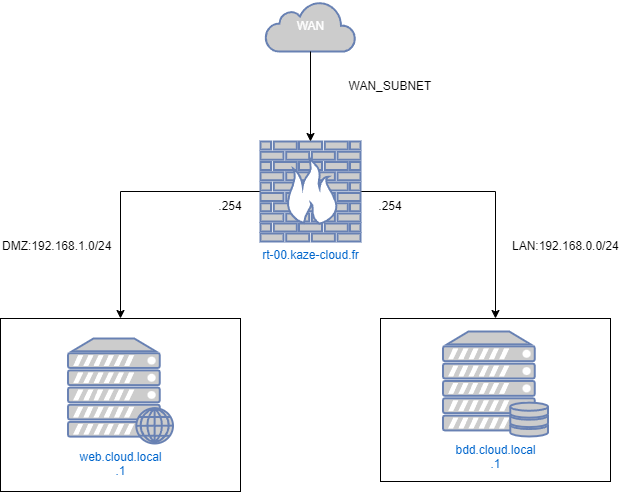

# Procédure installation & sécurisation site Wordpress [POC]

Cette documentation abordera de comment installer un site Wordpress de façon sécuriser pour un contexte de production.

## Réseaux
### Topologie



Les entreprises disposant d’un site Web public que les clients utilisent doivent rendre leur serveur Web accessible à Internet. Pour protéger le réseau local de l’entreprise, le serveur Web est installé sur un serveur distinct des ressources internes. La DMZ permet la communication entre les ressources commerciales protégées, telles que les bases de données internes, et le trafic qualifié d’Internet.

Un réseau DMZ sert de tampon entre Internet et le réseau privé d’une entreprise. La DMZ est isolée par une passerelle de sécurité, telle qu’un pare-feu, qui filtre le trafic entre la DMZ et un réseau LAN. Le serveur DMZ par défaut est protégé par une autre passerelle de sécurité qui filtre le trafic provenant de réseaux externes.

Nous utiliseront une machine virtuelle qui utilisera [opnsense](https://opnsense.org/) comme OS. Qui sera office de routeur firewall. Le compartiment des différents réseaux utilisera des switchs virtuels. 

### Matrice de flux et ACL

| Source/Destination | Serveur Web       | Serveur de BDD   | WAN          |
|--------------------|-------------------|-------------------|--------------|
| Serveur Web        | -                 | - permit          | - permit     |
| Serveur de BDD     | - deny            | -                 | - deny       |
| WAN                | - permit          | - deny            | -            |

Dans cette matrice :

- La connexion entre le serveur web et le serveur de base de données est autorisée.
- Le WAN peut accéder au serveur web, mais l'accès au serveur de base de données est refusé.
- Les tirets (-) indiquent les cases où aucun flux n'est autorisé ou refusé. Cela peut être interprété comme "aucune règle spécifique définie".
- Les données peuvent circuler de manière bidirectionnelle entre les sources et les destinations
- La règle par défaut est  `deny deny`

> Nous detailleronts pas la configuration d'ACL sur l'opnsense.

### NAT

Sur l'interface WAN il faudra créer la règle NAT de port forwarding suivante: 

| DESTINATION IP | FROM IP        | PORT | FORWARD IP  | FORWARD PORT | PROTOCOL |
|----------------|----------------|------|-------------|--------------|----------|
| @WAN_IP   | ANY                 | 80   | @LAN_IP_WEB | 80           | TCP      |
| @WAN_IP   | ANY                 | 443  | @LAN_IP_WEB | 443          | TCP      |

- **@WAN_IP** : Correspond à l'IP WAN de l'interface du routeur firewall
- **@LAN_IP_WEB** : Correspond à l'IP lan du serveur WEB. 

> Nous detailleronts pas la configuration de règles NAT de port forwarding sur l'opnsense.

## Back end

### Update

```bash
sudo apt update
```

```bash
sudo apt full-upgrade -y
```

```bash
reboot
```

### Installation base de données

Vous pouvez installer MariaDB à l'aide de la commande suivante :
```bash
apt install mariadb-server mariadb-client
```

Démarrez le démon du serveur de base de données et activez-le pour qu'il démarre automatiquement au prochain démarrage à l'aide des commandes suivantes :
```bash
systemctl start mariadb
systemctl enable mariadb
```

### Post installation

Une fois le serveur de base de données installé, exécutez la commande suivante pour sécuriser votre serveur MariaDB:
```bash
mysql_secure_installation
```

Plusieurs questions de configuration vous seront alors posées, auxquelles vous devrez répondre Y à chacune d'entre elles.
```bash
Remove anonymous users? [Y/n]: Y
Disallow root login remotely? [Y/n]: Y
Remove test database and access to it? [Y/n]:  Y
Reload privilege tables now? [Y/n]:  Y
```

Relancer le service mariadb:
```bash
systemctl restart mariadb
```

### Création un utilisateur base de données limiter

```bash
CREATE USER 'wordpress'@'192.168.0.1' IDENTIFIED BY 'CHANGEME';
CREATE DATABASE wordpress;
GRANT ALL PRIVILEGES ON wordpress.* TO 'wordpress'@'192.168.0.1';
FLUSH PRIVILEGES;
EXIT;
```

## Fron end

### Update

```bash
sudo apt update
```

```bash
sudo apt full-upgrade -y
```

```bash
reboot
```

### Installation basique de Wordpress

#### Installation Apache

Nous commencerons par le serveur web Apache.

Pour installer le serveur web Apache, exécutez la commande suivante :

```bash
sudo apt install apache2 -y
```

Puis on active le service:
```bash
sudo systemctl enable apache2 && sudo systemctl start apache2
```

Vérification que le sevice fonctionne:
```bash
sudo systemctl status apache2
```


La sortie de commande:
```bash
root@host:~# sudo systemctl status apache2
● apache2.service - The Apache HTTP Server
     Loaded: loaded (/lib/systemd/system/apache2.service; enabled; preset: enabled)
     Active: active (running) since Mon 2024-04-08 20:58:30 UTC; 13s ago
       Docs: https://httpd.apache.org/docs/2.4/
   Main PID: 2011 (apache2)
      Tasks: 55 (limit: 4652)
     Memory: 17.1M
        CPU: 141ms
     CGroup: /system.slice/apache2.service
             ├─2011 /usr/sbin/apache2 -k start
             ├─2012 /usr/sbin/apache2 -k start
             └─2013 /usr/sbin/apache2 -k start

Apr 08 20:58:30 wordpress systemd[1]: Starting apache2.service - The Apache HTTP Server...
Apr 08 20:58:30 wordpress systemd[1]: Started apache2.service - The Apache HTTP Server.
```

#### Installation PHP8.2

Ensuite, nous allons installer PHP. PHP8.2 est activé par défaut dans le dépôt Debian 12, donc pour installer PHP8.2 avec les extensions, exécutez les commandes suivantes :
```bash
sudo apt-get install php8.2 php8.2-cli php8.2-common php8.2-imap php8.2-redis php8.2-snmp php8.2-xml php8.2-mysqli php8.2-zip php8.2-mbstring php8.2-curl libapache2-mod-php -y
```

Pour vérifier la version de PHP installée, exécutez la commande suivante :
```bash
php -v
```

Vous devriez obtenir le résultat suivant :
```bash
PHP 8.2.7 (cli) (built: Jun  9 2023 19:37:27) (NTS)
Copyright (c) The PHP Group
Zend Engine v4.2.7, Copyright (c) Zend Technologies
    with Zend OPcache v8.2.7, Copyright (c), by Zend Technologies
```

#### Téléchargement Wordpress

Avant d'installer WordPress, nous devons d'abord le télécharger dans la racine par défaut du document Apache :
```bash
cd /var/www/html
wget https://wordpress.org/latest.zi
unzip latest.zip
rm latest.zip
```

Définir les bonnes autorisations pour les fichiers et les dossiers.
```bash
chown -R www-data:www-data wordpress/
cd wordpress/
find . -type d -exec chmod 755 {} \;
find . -type f -exec chmod 644 {} \;
```

Maintenant, ouvrez le fichier wp-config.php avec votre éditeur préféré et entrez les informations d'identification de la base de données que vous avez créées à l'étape précédente.
```bash
mv wp-config-sample.php wp-config.php
nano wp-config.php
```
Il devrait ressembler à ceci :
```wp-config.php
// ** Database settings - You can get this info from your web host ** //
/** The name of the database for WordPress */
define( 'DB_NAME', 'wordpress' );
/** Database username */
define( 'DB_USER', 'wordpress' );
/** Database password */
define( 'DB_PASSWORD', 'YourStrongPasswordHere' );
```

#### Création du VHOST Apache

```bash
cd /etc/apache2/sites-available/
touch wordpress.conf
```

Contenu
```
<VirtualHost *:80>
    ServerName wordpress.kaze-cloud-secu.local
    DocumentRoot /var/www/html/wordpress

    <Directory /var/www/html/wordpress>
        AllowOverride All
    </Directory>

    ErrorLog ${APACHE_LOG_DIR}/error.log
    CustomLog ${APACHE_LOG_DIR}/access.log combined

</VirtualHost>
```

Activez la configuration Apache pour WordPress et réécrivez le module.

```bash
sudo a2enmod rewrite
sudo a2ensite wordpress.conf
```

```apache2
systemctl reload apache2
```


### Sécurisation avec un certificat HTTPS

### Protection HST

### Protection CORS

### Sécurisation contre les bots : Crowdsec


```bash
```

```bash
```

```bash
```

